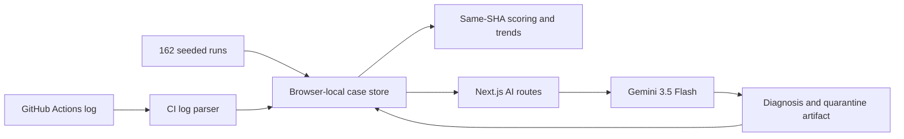

# Flaky

**Root-cause detection for non-deterministic CI tests.**

Most CI dashboards can tell you that a test sometimes fails. Flaky tells you why. It detects tests whose result changes on the same commit, correlates the source with errors and execution metadata, and asks Gemini for an evidence-backed root cause and concrete fix.

## What the demo proves

- Detects same-SHA pass/fail flips instead of confusing regressions with flakiness.
- Ranks test cases by a transparent flakiness score and commit trend.
- Connects fixed sleeps, preceding tests, network errors, and parallel-worker collisions to likely causes.
- Uses Gemini 3.5 Flash for diagnosis and quarantine artifacts.
- Clearly labels every result as **live Gemini** or **deterministic demo output**.
- Produces a before/proposed code fix and ready-to-paste quarantine PR description.
- Imports pasted or uploaded GitHub Actions, Jest, and Playwright logs.
- Persists demo mutations in browser storage, so the deployed demo needs no database.

## Run locally

```bash
npm install
copy .env.example .env.local
npm run dev
```

Open [http://localhost:3000](http://localhost:3000).

Configure live Gemini:

```env
GEMINI_API_KEY=your_key_here
GEMINI_MODEL=gemini-3.5-flash
AI_DEMO_FALLBACK=false
```

With no API key, Flaky remains demoable but labels diagnoses as **Demo investigator**. When a key is configured and Gemini cannot be reached, Flaky shows a retryable error—it does not silently substitute demo output.

## Judge demo path

1. Start on the dashboard and explain that flakiness means different outcomes on the same SHA.
2. Open **calculates tax for California address**.
3. Click **Diagnose case** and point to the live model badge, evidence chain, confidence, and proposed network mock.
4. Generate the quarantine PR description.
5. Return to the dashboard, choose **Import CI log**, and load the sample GitHub Actions failure.
6. Click **Ingest new run** to demonstrate the score updating without a CI integration.
7. Use reset to restore the pristine 162-run dataset.

The timed narration is in [docs/DEMO_SCRIPT.md](docs/DEMO_SCRIPT.md).

## Architecture



- `lib/ai.ts` is the only Gemini boundary.
- `lib/analytics.ts` owns scoring and commit trends.
- `lib/ci-parser.ts` converts CI text into normalized test runs.
- `lib/client-store.ts` makes demo state serverless-safe through browser storage.
- `lib/seed.ts` contains nine test cases and 162 deterministic runs.

See [docs/ARCHITECTURE.md](docs/ARCHITECTURE.md) for design decisions and [docs/SUBMISSION.md](docs/SUBMISSION.md) for the prepared hackathon copy.

## Flakiness score

For a test, group runs by commit SHA. A commit is inconsistent when it contains at least one pass and one failure. The score is:

```text
runs belonging to inconsistent commits / total runs × 100
```

A commit where every retry fails scores zero for flakiness: that is likely a deterministic regression, not a flaky test.

## Verification

```bash
npm run typecheck
npm run lint
npm run build
```

## Intentional scope

Flaky is optimized for a complete hackathon demo. The GitHub Actions importer accepts pasted or uploaded logs rather than requiring OAuth installation. Test source is seeded or supplied with the case; an actual repository app would fetch source at the recorded SHA. Browser-local state is deliberate for zero-setup judging and can later be replaced by a team database without changing the normalized data model.
